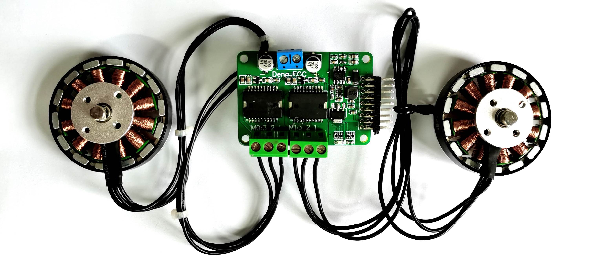

# 灯哥开源FOC V3.0 

灯哥开源 FOC控制器是一个由灯哥开源的，**基于Apache 2.0 开源协议和ESP32主控芯片**的低成本无刷电机双路FOC驱动控制板。**双路总功率240W，单路最大功率120W**，支持绝大部分的云台电机。编码器方面，**支持常见IIC、PWM以及ABI制式编码器**，是一个好用又便宜的双路无刷FOC驱动器。

## V3.0的重大突破

在V3版本中，<u>加入电流检测放大器INA240A2，通过采样与电机相串联的采样电阻电压获得A、B相电流，应用于**电流环控制**</u>，构建出真正，完整的FOC算法。

## FOC的应用场景

灯哥开源无刷FOC目前的发展受到灯哥开源团队的深度支持，目前已经针对这块控制板开发出了**灯哥开源无刷四足机器人**，后面更会开发出更多好玩的应用，例如**平衡车，倒立摆**等等，敬请关注。

