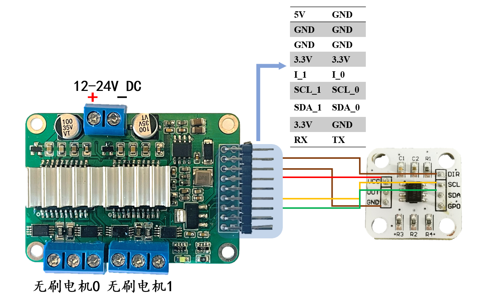
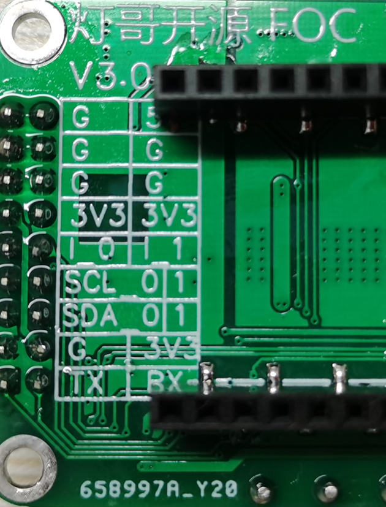

# 线路连接及其实例

灯哥开源FOC V3的线路连接与V2相同，极其简单，只需要连上电源线和电机线，就已经可以使得板子正常的运行开环控制；在此基础上，再连接上编码器，就可以使FOC控制板实现闭环控制。

<u>⚠️**注意：**若需要长时间调试或使用，你得加上散热片，**良好的散热能够使得FOC的性能得到充分发挥！**实验证明，大部分运行过程中突然的卡顿。震动都来自于FOC散热不良！！**在高电压电流的情况下，不良的FOC散热有可能导致驱动芯片烧毁。**在默认情形下，**灯哥官方建议一般都必须加上散热片使用！**</u>

推荐的散热片尺寸为25x25铝制散热片，安装效果如下图所示：

## 开环控制接线示意图

- ### 单纯的电机连接示意

## 闭环控制接线图（基于AS5600）

由于图幅限制，只展示一个电机配合一个编码器的接线，两个电机的接线亦同理，具体例程请参照例程文件夹。

## 闭环控制接线图（基于AS5047P）

由于图幅限制，只展示一个电机配合一个编码器的接线，两个电机的接线亦同理，具体例程请参照例程文件夹。

- 底面均有引脚示意

  

在完成了对应的接线，通电确定驱动板灯亮之后，就可以进入我们的下一步：*<u>编程环境配置</u>*