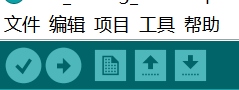
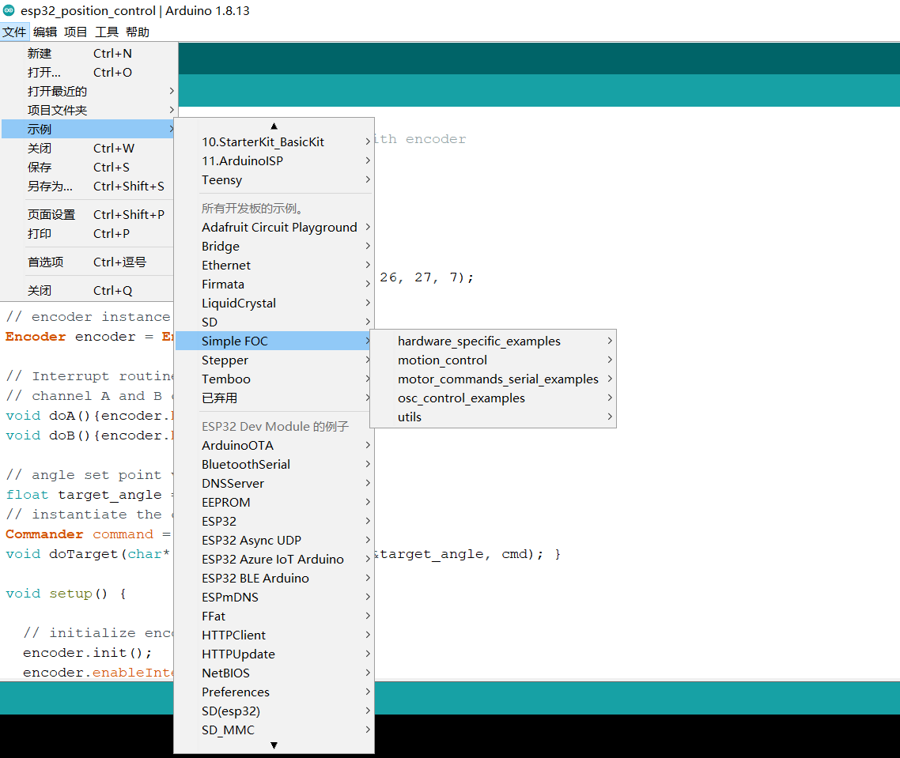

# 编程环境配置

灯哥开源FOC由于使用基于SimpleFOC的库运行，因此软件环境配置也与SimpleFOC库相同，默认都采用 **Arduino IDE** 作为主程序**编程/编译软件**。

 

最新测试过能够完美支持灯哥开源 FOC 的软件版本为：

- [x]  Arduino IDE 1.8.13
- [x]  **SimpleFOC Library 2.1.1**
- [x]  ESP32 Arduino Libiary 1.0.4

针对上面的软件版本，我已经做好整合包，大家直接下载解压就可以使用，避免繁杂的环境配置，下载地址：

-  Github：[Github 下载地址](https://github.com/ToanTech/Deng-s-foc-controller/tree/main/灯哥开源FOC专用 Arduino 编程环境)
-  Gitee（国内访问速度最快）：[Gitee 下载地址](https://gitee.com/ream_d/Deng-s-foc-controller/tree/main/灯哥开源FOC专用 Arduino 编程环境)

当完成下载后，解压下载的文件，点击文件中的arduino.exe 即可打开软件，开始编译例程，愉快的玩耍。

**<u>⚠️注意：解压前建议清除原有Arduino的环境；解压路径不要有中文路径。</u>**

 完成安装后，即可编译本项目提供的例程。并且进行程序的编写。

 在下幅图中，点击左上角的“√”进行程序的编译，当电脑连接了FOC控制板后，点击左上角的“→”进行程序上传，接下来就可以畅快的玩耍了。

⚠️注意，开发板必须选择: <u>***ESP32 DEV Module***</u>, 具体选择方式如下,必须如图上设置好之后才能编译并且使用：

而SFOC的官方例程会显示在这：

**<u>⚠️注意：想直接用此FOC板请直接使用我的例程！SFOC官方的例程是针对官方板子的，引脚不一样！不修改不能直接用在此板子上！而我给大家的例程都是已经改好调试过的！！</u>**

