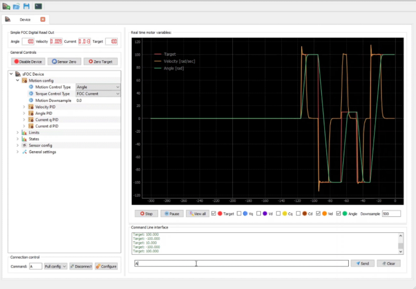

# 简介

**SimpleFOC Studio** 是一个可用于图形化配置 SimpleFOC，并且对电机进行 **在线PID调参的工具**，非常好用，主要特性包括：

 

- [x] 电机参数的实时调整和配置

- [x] 电机状态的实时绘图和监控

- [x] 可以根据配置好的参数自动生成代码，以植入到自己的程序中

- [x] 基于 PyQT5 安装配置简单，兼容性好。

软件的操作界面如下图所示，在本章中，将会详细讲述它的配置方式。

